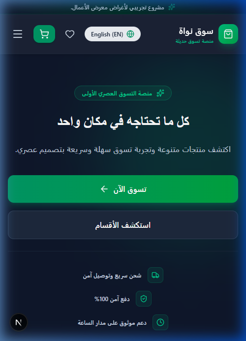
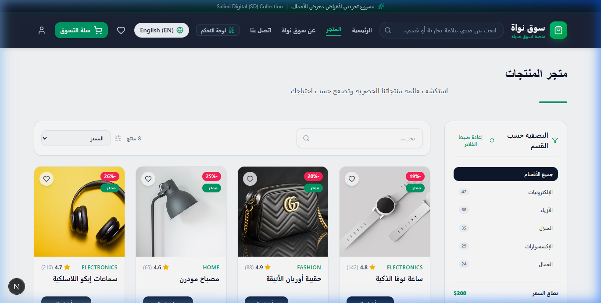

<div align="center">


# Nawa Digital Market & Grocery Platform
### سوق نوي الرقمي للمنتجات والسلع

[]()
[]()
[]()
[]()
[]()
[]()

**🇸🇦 منصة تسوق رقمية حديثة للمواد الغذائية والسلع، تحتوي على تصفية المنتجات، والعروض السريعة، وإدارة سلة التسوق لوحة التحكم والطلبات.**  
**🇺🇸 A next-generation grocery e-commerce platform featuring dynamic product filtering, flash sales, shopping cart management, and admin dashboard portal.**

</div>

---

# 📸 Project Preview | معاينة المشروع

<div align="center">

### 💻 Desktop Home Page View | واجهة سطح المكتب الرئيسية


<br/>

<table>
  <tr>
    <td width="50%" align="center">
      <b>📱 Mobile View | واجهة الجوال</b><br/><br/>
      
    </td>
    <td width="50%" align="center">
      <b>📄 Internal Page View | واجهة داخلية</b><br/><br/>
      
    </td>
  </tr>
</table>

</div>

---

# 📖 Overview | نظرة عامة

## 🇸🇦 العربية

يمثل مشروع **سوق نوي الرقمي للمنتجات والسلع** تطبيق ويب حديث وفاخر تم تطويره ليكون نموذجاً احترافياً ريادياً في قطاع **التجارة الإلكترونية الرقمية، تجارة التجزئة والسلع الاستهلاكية**.

- **قطاع الأعمال**: التجارة الإلكترونية الرقمية، تجارة التجزئة والسلع الاستهلاكية
- **فلسفة التصميم**: تعتمد الفلسفة البصرية على السلاسة، والجماليات العصرية، مع استخدام الألوان المناسبة للقطاع (**Emerald Green & Dark Mode / أخضر زاهي وواجهة مظلمة عصرية**)، وتحقيق أقصى درجات تجربة المستخدم (UX).
- **الغرض من المحفظة**: تم إنشاء هذا المشروع كجزء من محفظة الأعمال البرمجية للتعريف بالمهارات المتقدمة في هندسة الواجهات الأمامية ثنائية اللغة وتطبيقات الويب عالية الأداء.

> [!IMPORTANT]
> **تنبيه هام**: هذا المشروع هو مشروع محفظة أعمال افتراضي مصمم لأغراض العرض والتوضيح فقط (*Fictional portfolio project created for demonstration purposes*).

## 🇺🇸 English

**Nawa Digital Market & Grocery Platform** is a state-of-the-art web application developed to demonstrate production-grade engineering in the **Digital E-Commerce, Retail & FMCG Logistics** sector.

- **Business Sector**: Digital E-Commerce, Retail & FMCG Logistics
- **Design Philosophy**: Built around visual elegance, high-contrast typography, tailored color schemes (**Emerald Green & Dark Mode / أخضر زاهي وواجهة مظلمة عصرية**), and intuitive user interaction flows.
- **Portfolio Purpose**: Showcasing full-stack frontend design capability, bilingual architecture, dynamic components, and WCAG accessibility standards.

> [!IMPORTANT]
> **Notice**: This is a fictional portfolio project created for demonstration purposes.

---

# ✨ Features | المميزات الرئيسية

## 🇸🇦 العربية

- ✔ **منصة متجر رقمي متكاملة تدعم التصفية حسب الأقسام (إلكترونيات، أزياء، منزل، جمال).**
- ✔ **لوحة تحكم إدارية تفاعلية لعرض الإحصائيات والمبيعات وقائمة الطلبات.**
- ✔ **نظام سلة تسوق سريع يدعم تحديث الكميات وحفظ المنتجات المفضلة.**
- ✔ **دعم كامل للتصفح باللغتين العربية والإنجليزي واجهتين فاتحة ومظلمة.**
- ✔ **أداء خفيف واستجابة فائقة السرعة مع تقليل حجم المكونات وتحسين التجربة.**

## 🇺🇸 English

- ✔ **Full-featured e-commerce ecosystem supporting categories (Electronics, Fashion, Home, Beauty).**
- ✔ **Interactive administrative dashboard featuring sales metrics, order logs, and analytics.**
- ✔ **High-speed shopping cart system supporting instant updates and wishlist bookmarks.**
- ✔ **Full bilingual Arabic/English implementation with dark/light mode aesthetics.**
- ✔ **Optimized performance footprint built for lightning-fast page transitions.**

---

# 🛠️ Technology Stack | التقنيات المستخدمة

## 🇸🇦 العربية

| التقنية | سبب الاختيار والدور في المشروع |
| :--- | :--- |
| **Next.js 15** | الإطار الأساسي للبناء، يوفر السرعة العالية، والتقسيم التلقائي للأكواد (App Router)، والدعم الممتاز لصفحات SSR/SSG. |
| **React 19** | مكتبة بناء الواجهات، تعتمد على المكونات القابلة لإعادة الاستخدام وإدارة الحالة بسلاسة. |
| **TypeScript 5** | لضمان جودة الكود، وتجنب الأخطاء البرمجية من خلال الأنواع الصريحة (Strict Typing). |
| **Tailwind CSS 4** | لتصميم واجهات عصرية ومتجاوبة بسرعة عالية وبأداء ممتاز بدون ملفات CSS ضخمة. |
| **Framer Motion** | لإضافة حركات وتأثيرات بصرية تفاعلية تجعل تجربة المستخدم حية وجذابة. |
| **Lucide React** | أيقونات عصرية خفيفة الوزن ومتناغمة بجمالية مع جميع عناصر التصميم. |

## 🇺🇸 English

| Technology | Rationale & Implementation Role |
| :--- | :--- |
| **Next.js 15** | Core framework providing App Router, SSR/SSG rendering, dynamic imports, and SEO optimizations. |
| **React 19** | Component-driven architecture enabling modular state management and seamless re-renders. |
| **TypeScript 5** | Type-safe code standard preventing runtime errors and ensuring strict contract definitions. |
| **Tailwind CSS 4** | Utility-first styling engine driving responsive breakpoints, fluid typography, and dark mode design. |
| **Framer Motion** | Micro-interactions and smooth page transitions elevating the emotional feel of the user interface. |
| **Lucide React** | Clean, accessible vector icons ensuring iconographic consistency across light & dark components. |

---

# 🎨 Design Philosophy | فلسفة التصميم

## 🇸🇦 العربية

تم بناء الهوية البصرية لمشروع **سوق نوي الرقمي للمنتجات والسلع** لتعكس الاحترافية العالية والدقة الشديدة:
- **نظام الألوان**: اختيار وتنسيق ألوان **Emerald Green & Dark Mode / أخضر زاهي وواجهة مظلمة عصرية** لخلق انطباع مبهر وفخم.
- **التجربة ثنائية اللغة**: دعم الأصالة العربية من خلال خطوط Modern Standard Arabic مريحة للعين مع تحويل اتجاه الواجهة (RTL/LTR) بسلاسة فائقة.
- **الحركة التفاعلية**: استخدام المؤثرات الحركية الدقيقة (Micro-animations) لإعطاء روح تفاعلية عند التمرير والضغط.

## 🇺🇸 English

The design system for **Nawa Digital Market & Grocery Platform** is engineered around premium aesthetics:
- **Palette**: Mastered palette around **Emerald Green & Dark Mode / أخضر زاهي وواجهة مظلمة عصرية** evoking trust, prestige, and focus.
- **Bilingual Typographic Harmony**: Native Modern Standard Arabic paired with clean sans-serif English fonts for seamless RTL & LTR transitions.
- **Interactive Depth**: Smooth hover feedback, glassmorphism containers, and refined elevation drops.

---

# 📑 Pages Overview | دليل الصفحات

## 🇸🇦 العربية

- **`/`**: الصفحة الرئيسية - الأقسام الرئيسية، العروض اليومية، والأكثر مبيعاً
- **`/shop`**: متجر المنتجات - تصفية السلع، البحث السريع وتصفح الأقسام السريعة
- **`/dashboard`**: لوحة التحكم - إدارة المبيعات، الطلبات، المخزون والإحصائيات البيانية
- **`/about`**: عن سوق نوي - رؤية التوصيل السريع والضمان والجودة
- **`/contact`**: تواصل معنا - الدعم الفني، الشكاوى والمقترحات ودعم العملاء

## 🇺🇸 English

- **`/`**: Home Page - Category browser, daily flash deals, and trending items
- **`/shop`**: Product Market - Multi-category filter, instant live search, and sorting
- **`/dashboard`**: Admin Dashboard - Sales analytics, order tracking, inventory management, and metrics
- **`/about`**: About Nawa - Fast delivery vision, quality guarantee, and local sourcing
- **`/contact`**: Contact & Support - Helpdesk, customer inquiries, and store locator

---

# 📁 Folder Structure | هيكلية المشروع

## 🇸🇦 العربية و 🇺🇸 English

```text
sd-05-nawa-market/
├── app/
│   ├── layout.tsx
│   ├── page.tsx
│   ├── shop/
│   │   └── page.tsx
│   ├── dashboard/
│   │   └── page.tsx
│   └── contact/
│       └── page.tsx
├── components/
│   ├── layout/
│   │   ├── Header.tsx
│   │   └── Footer.tsx
│   └── market/
│       ├── ProductCard.tsx
│       └── DashboardMetrics.tsx
├── public/
│   ├── banner.svg
│   ├── og-image.svg
│   └── screenshots/
│       ├── home-desktop.png
│       ├── home-mobile.png
│       └── internal-page.png
├── CHANGELOG.md
├── CONTRIBUTING.md
├── LICENSE
└── README.md
```

---

# 📱 Responsive Design | التصميم المتجاوب

## 🇸🇦 العربية

تم تطوير الواجهة باتباع منهجية **الجوال أولاً (Mobile-First)** لضمان تجربة مستخدم مثالية على كافة الشاشات:
- **Desktop**: دقة 1440px وأعلى مع استغلال المساحات العريضة.
- **Tablet**: دقة 768px إلى 1024px مع شبكة مرنة تكيّف المكونات تلقائياً.
- **Mobile**: دقة 390px وأصغر مع أزرار لمس مريحة وقائمة جانبية سهلة الاستخدام.

## 🇺🇸 English

Designed using **Mobile-First Principles** to ensure absolute perfection on all viewports:
- **Desktop Grid (1440px+)**: Expansive multi-column layouts leveraging wide screens.
- **Tablet Grid (768px - 1024px)**: Adaptive column wrapping and fluid flex layouts.
- **Mobile Grid (390px)**: Touch-optimized targets, collapsible drawer navigation, and zero horizontal scroll.

---

# ⚡ Performance Optimization | الأداء والسرعة

## 🇸🇦 العربية

- **Next.js Image**: ضغط الصور تلقائياً وتحويلها لشكل WebP/AVIF لتقليل زمن التحميل.
- **Dynamic Imports**: تحميل المكونات الثقيلة عند الحاجة فقط لتسريع الاستجابة الأولى.
- **Font Optimization**: تحميل الخطوط مباشرة عبر `next/font` لمنع الشاشة البيضاء (CLS).

## 🇺🇸 English

- **Next.js Image Engine**: Automated image resizing, format conversion (WebP/AVIF), and lazy loading.
- **Dynamic Imports**: Lazy-loading non-critical components to lower initial JavaScript execution time.
- **Font Optimization**: Self-hosted Google Fonts via `next/font` eliminating Cumulative Layout Shift (CLS).

---

# ♿ Accessibility (a11y) | إكانية الوصول

## 🇸🇦 العربية

- دعم التصفح الكامل عبر لوحة المفاتيح (Keyboard Navigation).
- وضوح التباين للألوان وفق معايير WCAG AA.
- استخدام التسميات ARIA Labels وعناصر HMTL5 الدلالية (`<header>`, `<main>`, `<nav>`).

## 🇺🇸 English

- Complete keyboard focus management and screen reader support.
- Color contrast ratio compliance meeting WCAG AA standards.
- Full ARIA semantics (`aria-label`, `aria-expanded`) and semantic HTML structure.

---

# 💻 Installation & Setup | التثبيت والتشغيل

## 🇸🇦 العربية و 🇺🇸 English

```bash
# 1. Clone the repository | استنساخ المستودع
git clone https://github.com/malsalimi/sd-05-nawa-market.git

# 2. Navigate into the project folder | الانتقال لتركي المشروع
cd nawa-market

# 3. Install dependencies | تثبيت الحزم البرمجية
npm install

# 4. Start local development server | تشغيل خادم التطوير المحلي
npm run dev

# 5. Open browser at | افتح المتصفح على الرابط
http://localhost:3000
```

---

# 🩺 Repository Health | صحة المستودع والملفات

- **`CHANGELOG.md`**: [سجل التغييرات والإصدارات](CHANGELOG.md)
- **`CONTRIBUTING.md`**: [دليل المساهمة والترخيص](CONTRIBUTING.md)
- **`LICENSE`**: [ترخيص الاستخدام والتعليم](LICENSE)

---

# 🔮 Future Improvements | التحسينات المستقبلية

## 🇸🇦 العربية

- إضافة الربط الفعلي مع بوابات الدفع الإلكترونية (Stripe / Local Gateways).
- دمج الذكاء الاصطناعي لتوفير مساعد افتراضي ذكي للإجابة على استفسارات الزوار.

## 🇺🇸 English

- Integration of active payment gateway processors (Stripe / Local Fintech APIs).
- AI Conversational Assistant integration for real-time customer support.

---

# 👨‍💻 Author | المؤلف

<table align="center">
  <tr>
    <td align="center">
      <h2>المهندس محمد السالمي | Eng. Mohammed Al Salimi</h2>
      <p><b>مؤسس Salimi Tech | Founder of Salimi Tech</b></p>
      <p>Frontend Developer | Cybersecurity Specialist | UI/UX Designer</p>
      <p>
        🌐 <a href="https://salimi-tech.vercel.app">salimi-tech.vercel.app</a> &nbsp;|&nbsp;
        🐙 <a href="https://github.com/malsalimi">github.com/malsalimi</a> &nbsp;|&nbsp;
        📞 <a href="tel:+967772076053">+967 772 076 053</a>
      </p>
      <p>© 2026 Mohammed Al Salimi. All Rights Reserved.</p>
    </td>
  </tr>
</table>

---

# 📜 License | الترخيص

**Portfolio & Educational Purposes License**  
جميع الحقوق محفوظة للمهندس محمد السالمي (Salimi Tech). هذا المشروع مخصص للمحفظة والاستعراض التعليمي.

---

# 🌟 Salimi Digital (SD) Collection

## 🇸🇦 العربية

هذا المشروع جزء من سلسلة **Salimi Digital (SD) Collection**، وهي مجموعة مشاريع احترافية تهدف إلى استعراض مهارات تطوير الويب الحديثة باستخدام Next.js وTypeScript وTailwind CSS من خلال تطبيقات ثنائية اللغة وتصاميم متجاوبة وعالية الجودة.

## 🇺🇸 English

This project is part of the **Salimi Digital (SD) Collection**, a professional portfolio showcasing modern bilingual web applications built with Next.js, TypeScript, and Tailwind CSS, featuring responsive design, clean architecture, and production-quality user interfaces.
